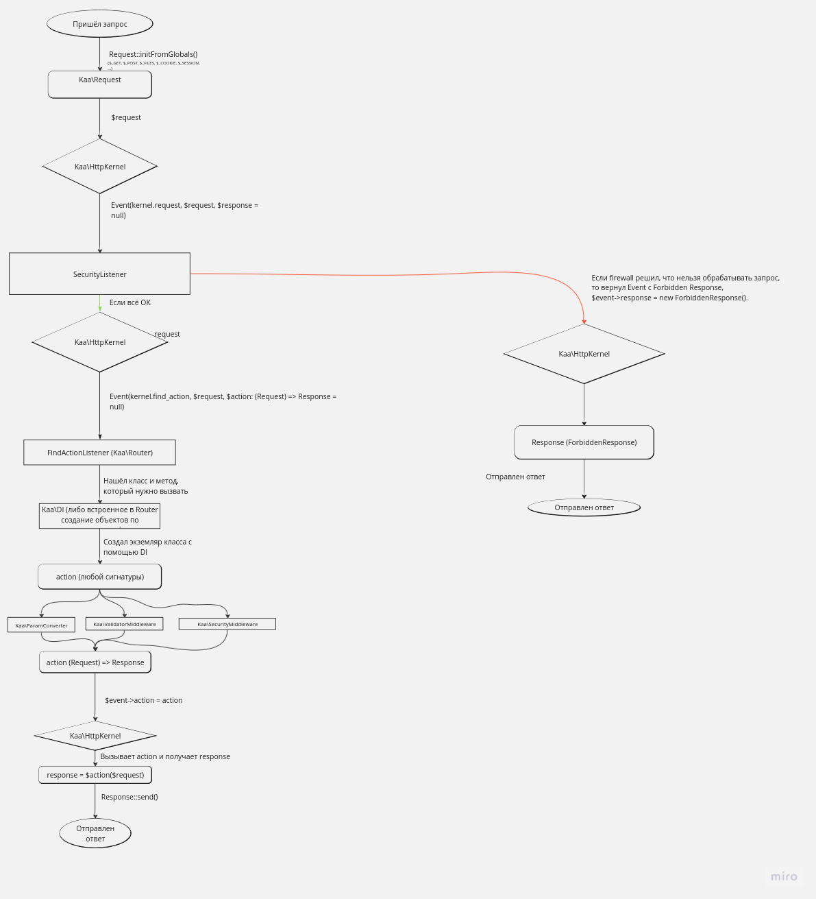

# Kaa &mdash; web-фреймворк для KPHP

### Разработка
- Название ветки должно совпадать с названием модуля, над которым работаете
- Сообщения коммитов должны следовать паттерну [Conventional Commits](https://www.conventionalcommits.org/en/v1.0.0/)

### Структура фреймворка
Фреймворк состоит из следующих модулей:

+ [PhpGenerator](docs/PhpGenerator.md) - библиотека для удобной генерации кода

+ [HttpMessage](docs/HttpMessage.md) - предоставляет классы для удобной работы с запросами и ответами HTTP

+ [EventDispatcher](docs/EventDispatcher.md) - отправка и подписка на сообщения

+ [HttpKernel](docs/HttpKernel.md) - обработка HTTP-запроса от самого начала до ответа

+ [Validator](docs/Validator.md) - валидация полей объектов

+ [Router](docs/Router.md) - принимает объект Request и возвращает callback, который нужно вызвать для его обработки

+ [DependencyInjection](docs/DependencyInjection.md) - генерирует код для создания объектов

+ [Security](docs/Security.md) - принимает объект запроса и решает имеет ли пользователь, отправивший его, доступ к этому запросу...

### [Диаграмма обработки запроса](https://miro.com/welcomeonboard/dkV1ZXNGekY3R2dTM1pzRmN1SWpQMTllUGdBbWhMaEJyR0JxR0E4RE5zem9iTlJ5YTRQWjRNbktRTk9laU95TnwzNDU4NzY0NTM2NTEwODMzNzI1fDI=?share_link_id=856045042759)

